# Table of contents  
- [1. Tree](#1-tree)
- [2. Built with](#2-built-with)
    - [2.1 Languages](#21-languages)
    - [2.2 Architecture](#22-architecture)
    - [2.3 Components](#23-components)
- [3. How to configure](#3-how-to-configure)
    - [3.1 Configure base project](#31-configure-base-project)
        - [3.1.1 Change application id](#311-change-application-id)
        - [3.1.2 Change package name](#312-change-package-name)
        - [3.1.3 Change application launcher icon](#313-change-application-launcher-icon)
        - [3.1.4 Change application name](#314-change-application-name)
        - [3.1.5 Change font](#315-change-font)
    - [3.2 Configure firebase core](#32-configure-firebase-core)
    - [3.3 Configure push notification](#33-configure-push-notification)
    - [3.4 Configure crashlytics](#34-configure-crashlytics)
- [Guideline](#guideline)
- [Extras](#extras)
    - [Fetch Signing Fingerprint](#fetch-signing-fingerprint)
    - [Fetch Android Hash Key](#fetch-android-hash-key)
    - [Show Application Local Data](#show-application-local-data)
- [Authors](#authors)
- [Technical Documentation](#technical-documentation)
- [Releases](#releases)
- [Contributing](#contributing)

# 1. Tree
Tree is a native application which contains all the essential codes (boiler-plate) to kick start an Android project.

# 2. Built with
## 2.1 Languages
1. <code>Kotlin</code>
2. <code>Java</code>
3. <code>XML</code>
4. <code>MarkDown</code>

## 2.2 Architecture
1. <code>MVP (Model View Presenter)</code>

## 2.3 Components
1. <code>MVP (Model View Presenter)</code>
    
# 3. How to configure
## 3.1 Configure base project
### 3.1.1 Change applicaiton id
| No | Action | Screenshot |
| :---: | :---: | :---: |
| 1 | Go to <code>build.gradle(app)</code> file and copy the <code>applicationId</code> | 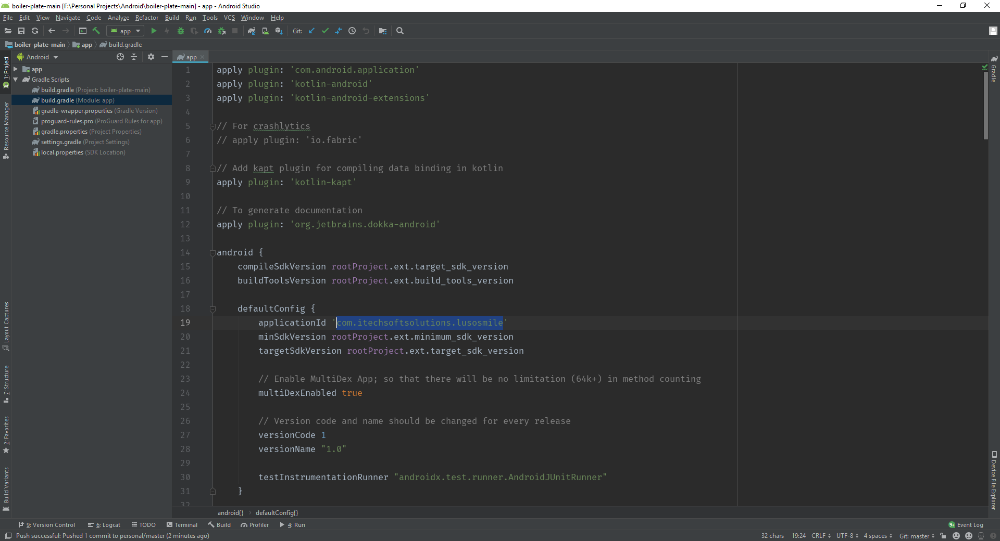 | 
| 2 | Go to <code>Title Bar Menu > Edit > Find > Replace in Path</code> | 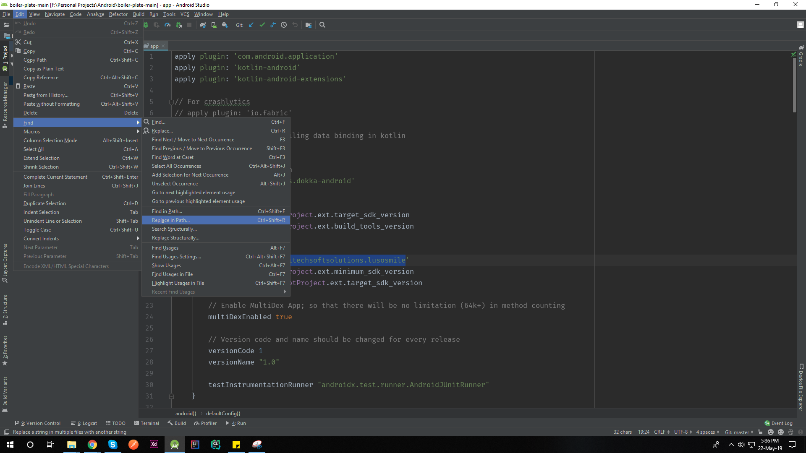 |
| 3 | Paste the old application id in the first field and write down the new application id in the second field. Then press <code>Replace All</code> | 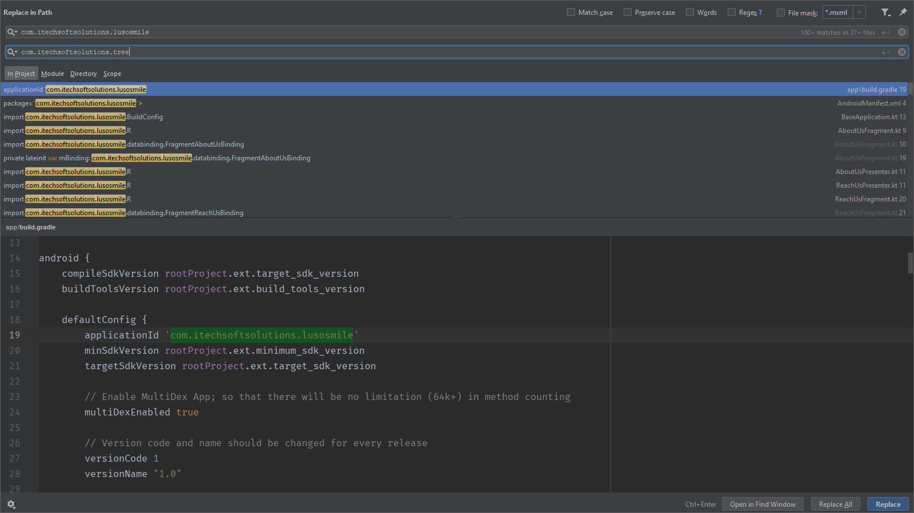 | 
| 4 | If alert dialog pops up, then click on <code>Replace</code> | 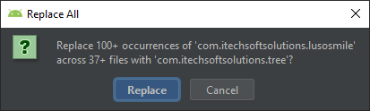 |
| 5 | Wait | - |
| 6 | Go to <code>Build > Clean Project</code> | - |
| 7 | Sync gradle| - |

### 3.1.2 Change package name
| No | Action | Screenshot |
| :---: | :---: | :---: |
| 1 | Open the project, Select the <code>Project</code> type as file structure(top left) | 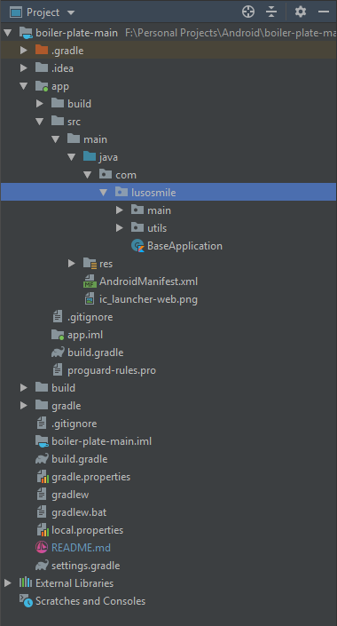 | 
| 2 | Right click and go to <code>Refactor > Rename</code> | 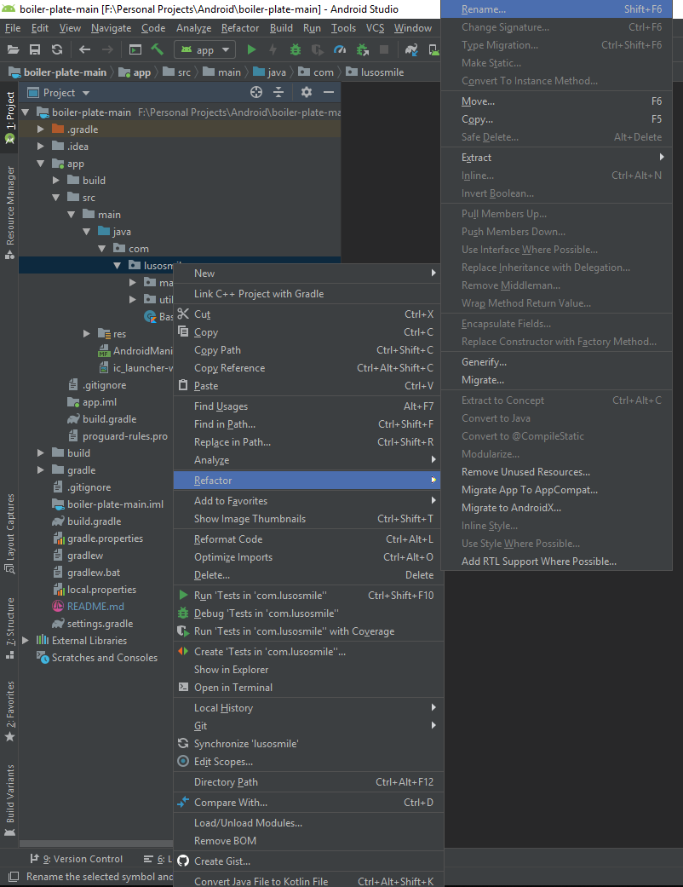 |
| 3 | Put new app name | 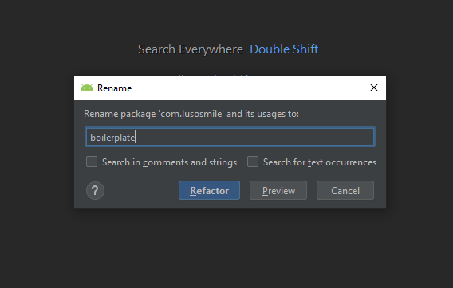 | 
| 4 | Click on <code>Do Refactor</code> if the dialog pops up | 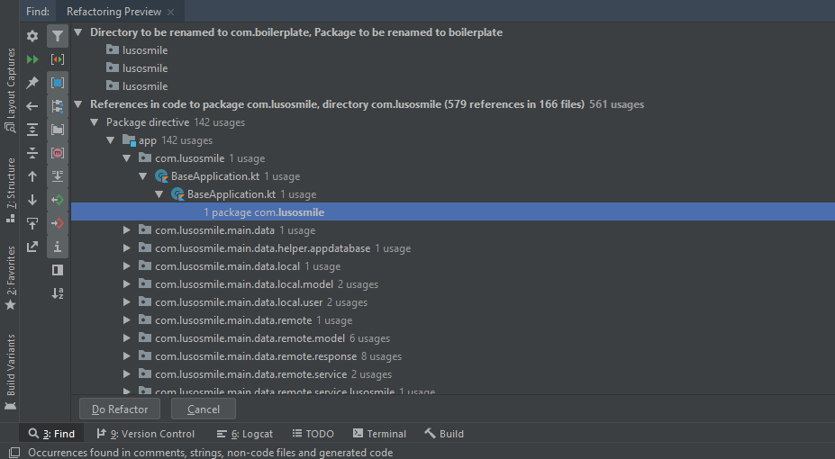 |
| 5 | Wait | 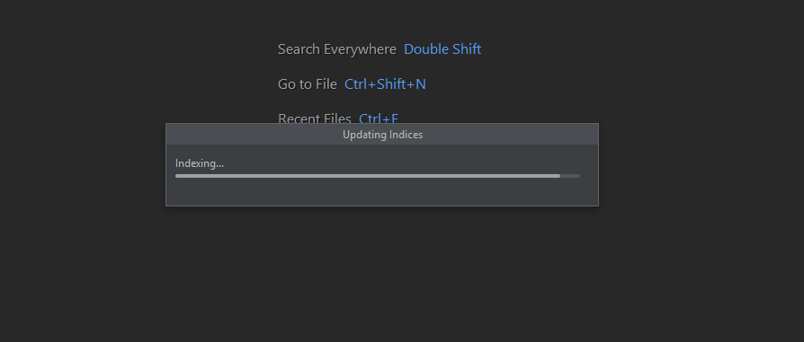 |

### 3.1.3 Change application launcher icon
| No | Action | Screenshot |
| :---: | :---: | :---: |
| 1 | Open the project, Select the <code>Android</code> type as file structure(top left). Then right click on the <code>res</code> folder. | 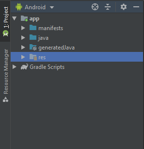 | 
| 2 | Go to <code>New > Image Asset</code> | 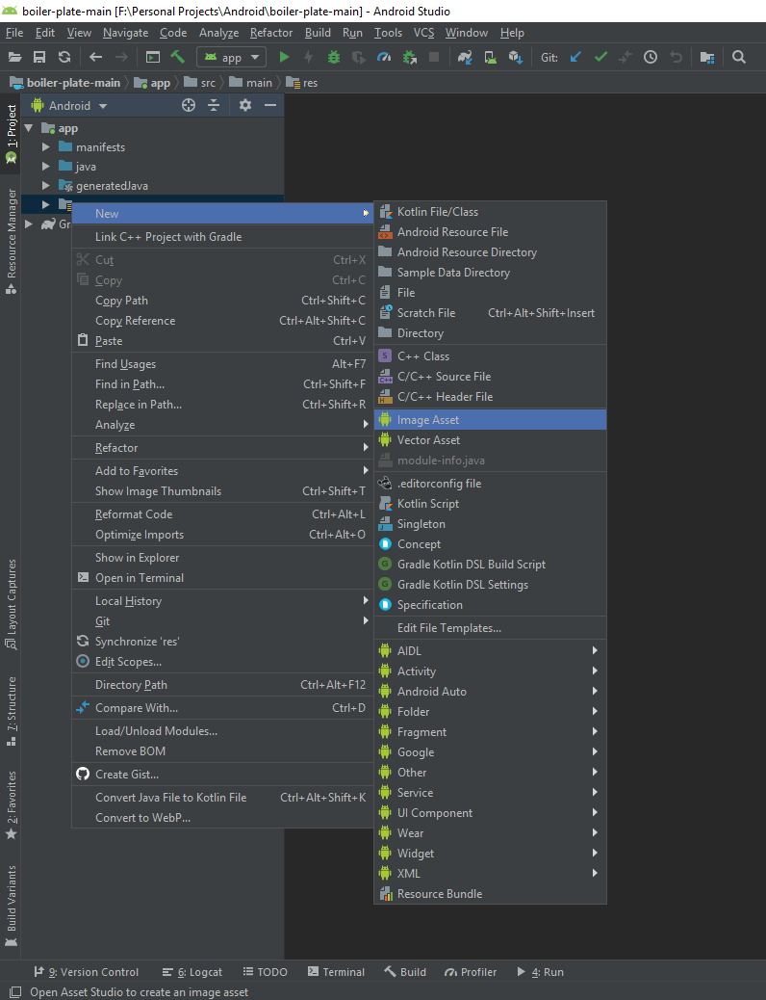 |
| 3 | There are two main tabs here, <code>Foreground Layer</code> & <code>Background Layer</code>. We can select assets for foreground and background from these tabs. | 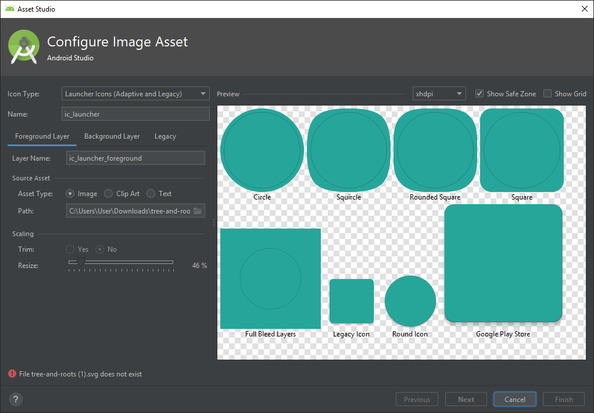 | 
| 4 | (Optional) Browse images (vector is also acceptable) clicking on the folder icon | 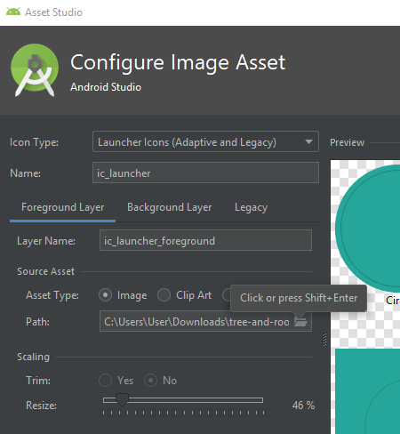 |
| 5 | Choose the asset | 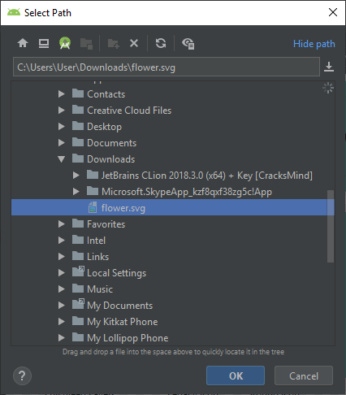 |
| 6 | <code>Show Grid</code> can be ticked in order to see the boundaries. Other settings can also be modified. | 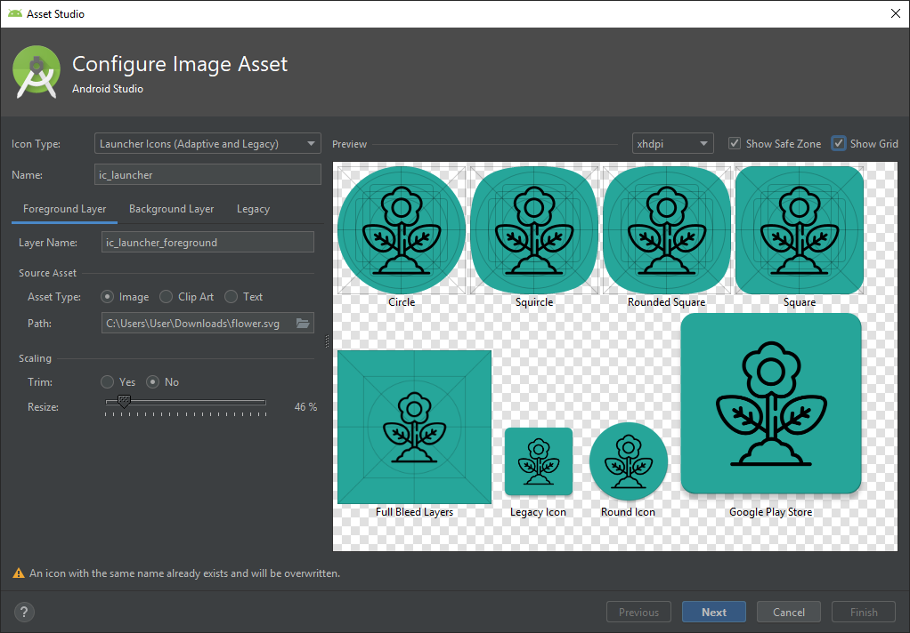 |
| 7 | Asset can be picked for background, in the <code>Background Layer</code> tab. Click on next if it seems okay. | 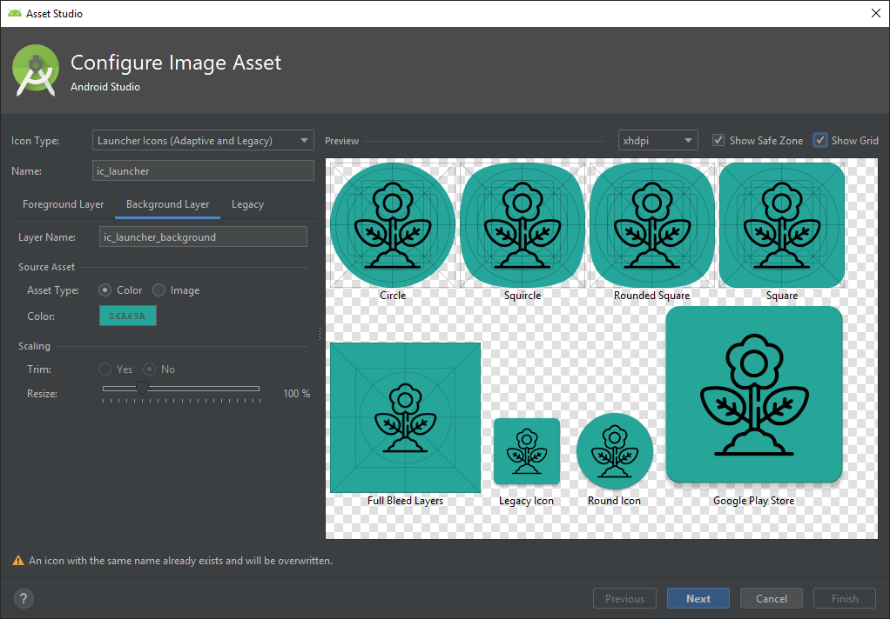 |
| 8 | Finish the dialog and your launcher icon is changed now | 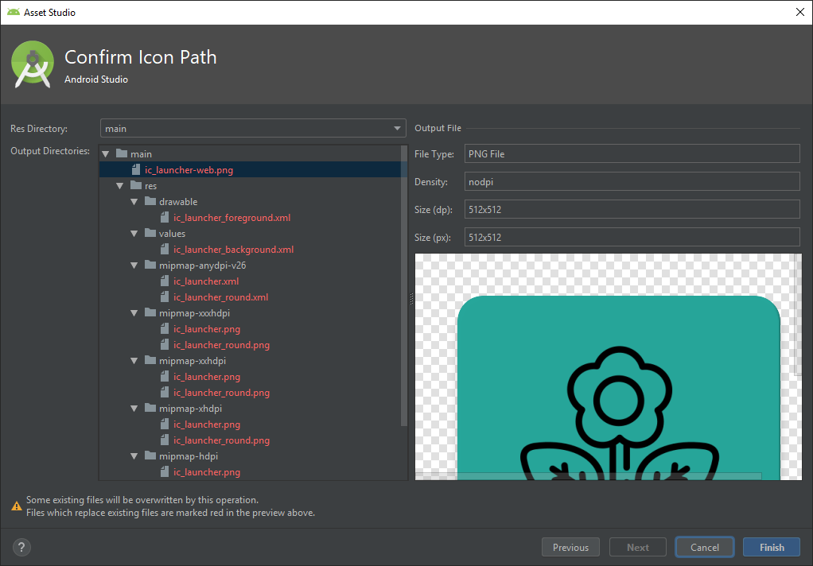 |

### 3.1.4 Change application name 
| No | Action | Screenshot |
| :---: | :---: | :---: |
| 1 | Change <code>app_name</code> from <code>string.xml</code> of all the languages | 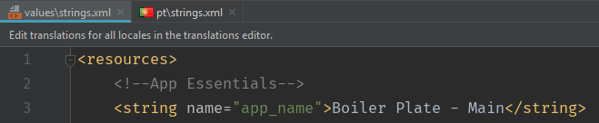 | 

### 3.1.5 Change font
| No | Action | Screenshot |
| :---: | :---: | :---: |
| 1 | Overwrite <code>regular.ttf</code> from <code>font</code> directory in order to achieve text changes globally in the application of regular fonts. Additional fonts can be added; i.e. <code>bold</code>, <code>italic</code> etc. | 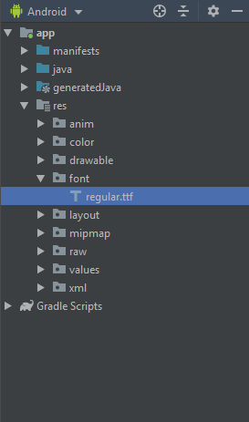|
    
## 3.2 Configure firebase core
1. Visit [here](https://tinyurl.com/yyebfbnu) and complete step 1-3
2. Activate at <code>build.gradle</code>
    * <code>implementation 'com.google.firebase:firebase-core:16.0.8'</code>
    
## 3.3 Configure push notification
1. [Configure firebase core](#configure-firebase-core)  
2. Uncomment at <code>build.gradle</code> file 
    * <code>implementation 'com.google.firebase:firebase-messaging:17.6.0'</code>
    * <code>apply plugin: 'com.google.gms.google-services'</code>
3. Uncomment at <code>NotificationService.kt</code>
    * All the commented lines
4. Uncomment at <code>AndroidManifest.xml</code>
    * <code>com.lusosmile.main.data.remote.service.NotificationService</code>
5. To know about getting the device registration token, [visit here](https://tinyurl.com/y6lndsa4)

## 3.4 Configure crashlytics
1. [Configure firebase core](#configure-firebase-core)
2. Configure crashlytics at firebase console. To know more, [visit here](http://bit.ly/2VBDluy) 
3. Uncomment at <code>build.gradle</code> 
    * <code>apply plugin: 'io.fabric'</code>
    * <code>implementation 'com.crashlytics.sdk.android:crashlytics:2.9.9'</code>
    * <code>apply plugin: 'com.google.gms.google-services'</code>
4. Uncomment at <code>BaseApplication.kt</code>
    * <code>import com.google.firebase.analytics.FirebaseAnalytics</code>
    * <code>FirebaseAnalytics.getInstance(context)</code>
    
# 4. Guideline
## 4.1 File naming

### 4.1.1 Class files
Class names are written in [UpperCamelCase](http://en.wikipedia.org/wiki/CamelCase). For classes that extend an Android component, the name of the class should end with the name of the component; for example: `SignInActivity`, `SignInFragment`, `ImageUploaderService`, `ChangePasswordDialog`.

### 4.1.2 Resources files
Resources file names are written in __lowercase_underscore__.

#### 4.1.2.1 Drawable files
Naming conventions for drawables:

| Asset Type   | Prefix            |		Example               |
|--------------| ------------------|-----------------------------|
| Action bar   | `ab_`             | `ab_stacked.png`          |
| Button       | `btn_`	            | `btn_send_pressed.png`    |
| Dialog       | `dialog_`         | `dialog_top.png`          |
| Divider      | `divider_`        | `divider_horizontal.png`  |
| Icon         | `ic_`	            | `ic_star.png`               |
| Menu         | `menu_	`           | `menu_submenu_bg.png`     |
| Notification | `notification_`	| `notification_bg.png`     |
| Tabs         | `tab_`            | `tab_pressed.png`         |

Naming conventions for icons (taken from [Android iconography guidelines](http://developer.android.com/design/style/iconography.html)):

| Asset Type                      | Prefix             | Example                      |
| --------------------------------| ----------------   | ---------------------------- |
| Icons                           | `ic_`              | `ic_star.png`                |
| Launcher icons                  | `ic_launcher`      | `ic_launcher_calendar.png`   |
| Menu icons and Action Bar icons | `ic_menu`          | `ic_menu_archive.png`        |
| Status bar icons                | `ic_stat_notify`   | `ic_stat_notify_msg.png`     |
| Tab icons                       | `ic_tab`           | `ic_tab_recent.png`          |
| Dialog icons                    | `ic_dialog`        | `ic_dialog_info.png`         |

Naming conventions for selector states:

| State	       | Suffix          | Example                     |
|--------------|-----------------|-----------------------------|
| Normal       | `_normal`       | `btn_order_normal.png`    |
| Pressed      | `_pressed`      | `btn_order_pressed.png`   |
| Focused      | `_focused`      | `btn_order_focused.png`   |
| Disabled     | `_disabled`     | `btn_order_disabled.png`  |
| Selected     | `_selected`     | `btn_order_selected.png`  |

#### 4.1.2.2 Layout files
Layout files should match the name of the Android components that they are intended for but moving the top level component name to the beginning. For example, if we are creating a layout for the `SignInActivity`, the name of the layout file should be `activity_sign_in.xml`.

| Component        | Class Name             | Layout Name                   |
| ---------------- | ---------------------- | ----------------------------- |
| Activity         | `UserProfileActivity`  | `activity_user_profile.xml`   |
| Fragment         | `SignUpFragment`       | `fragment_sign_up.xml`        |
| Dialog           | `ChangePasswordDialog` | `dialog_change_password.xml`  |
| AdapterView item | ---                    | `item_person.xml`             |
| Partial layout   | ---                    | `partial_stats_bar.xml`       |

A slightly different case is when we are creating a layout that is going to be inflated by an `Adapter`, e.g to populate a `RecyclerView`. In this case, the name of the layout should start with `item_`.

Note that there are cases where these rules will not be possible to apply. For example, when creating layout files that are intended to be part of other layouts. In this case you should use the prefix `partial_`.

#### 4.1.2.3 Menu files
Similar to layout files, menu files should match the name of the component. For example, if we are defining a menu file that is going to be used in the `UserActivity`, then the name of the file should be `activity_user.xml`. A good practice is to not include the word `menu` as part of the name because these files are already located in the `menu` directory.

#### 4.1.2.4 Values files
Resource files in the values folder should be __plural__, e.g. `strings.xml`, `styles.xml`, `colors.xml`, `dimens.xml`, `attrs.xml`
    
# 5. Extras
## 5.1 Fetch signing fingerprint
### 5.1.1 Release
1. Add the path of <code>keytool</code> from <code>JDK</code> to System Variable <code>PATH</code>
2. Go to <code>keystore</code> folder
3. Press <code>Shift + Right</code> Click
4. Start command prompt
5. Put command <code>keytool -exportcert -alias ALIAS_NAME -keystore KEYSTORE_NAME_WITH_EXTENSION -list -v</code>

### 5.1.2 Debug
1. Go to right side of Android Studio.
2. Execute <code>Gradle > root > Tasks > android > signingReport</code>

## 5.2 Fetch android hash key
1. Uncomment at <code>BaseApplication.kt</code>
    * <code>import com.boilerplate.utils.helper.DataUtils</code>
    * <code>DataUtils.getAndroidHashKey()</code> at <code>onCreate()</code>
2. Connect a device via <code>adb</code> and install the application into it
3. Open the application at device
4. Open Logcat from Android Studio
5. Filter the <code>Info</code> logs
6. Search for the tag <code>Hash</code>
7. Get the hash key depending on the build variant; i.e: <code>debug, release</code>

## 5.3 Show application local data
1. Uncomment at <code>build.gradle</code>
    * <code>debugImplementation 'com.awesomedroidapps:inappstoragereader:1.0.2'</code>
2. Visit <code>App Data</code> from your device. It will have similar icon as the app launcher.

# 6. Authors
* Mohd. Asfaq-E-Azam Rifat, Executive Software Engineer - [Rifat](https://github.com/rifat15913)

# 7. Technical documentation
The technical documentation is located [here.](app/documentation/)

# 8. Releases
Please visit [this link](app/release/) to get the latest build.

# 9. Contributing
Pull requests are welcome. For major changes, please open an issue first to discuss what you would like to change.