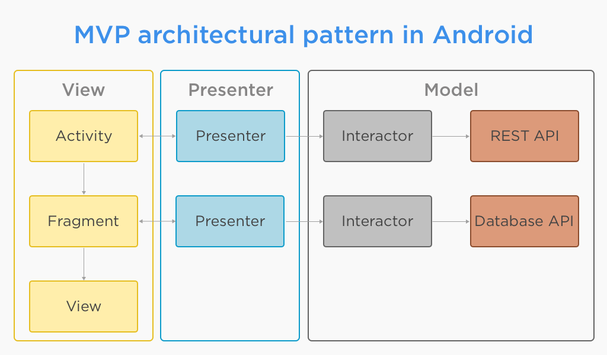

# Table of contents  
- [1. Tree](#1-tree)
- [2. Built with](#2-built-with)
    - [2.1 Languages](#21-languages)
    - [2.2 Architecture](#22-architecture)
    - [2.3 Components](#23-components)
- [3. How to configure](#3-how-to-configure)
    - [3.1 Configure base project](#31-configure-base-project)
        - [3.1.1 Change application id](#311-change-application-id)
        - [3.1.2 Change package name](#312-change-package-name)
        - [3.1.3 Change application launcher icon](#313-change-application-launcher-icon)
        - [3.1.4 Change application name](#314-change-application-name)
        - [3.1.5 Change font](#315-change-font)
    - [3.2 Configure firebase core](#32-configure-firebase-core)
    - [3.3 Configure push notification](#33-configure-push-notification)
    - [3.4 Configure crashlytics](#34-configure-crashlytics)
- [4. Guideline](#4-guideline)
    - [4.1 File naming guideline](#41-file-naming-guideline)
        - [4.1.1 Class files](#411-class-files)
        - [4.1.2 Resources files](#412-resource-files)
    - [4.2 Code guideline](#42-code-guideline)
        - [4.2.1 Java language rules](#421-java-language-rules)
        - [4.2.2 Java style rules](#422-java-style-rules)
        - [4.2.3 XML style rules](#423-xml-style-rules)
- [5. Extras](#5-extras)
    - [5.1 Fetch signing fingerprint](#51-fetch-signing-fingerprint)
        - [5.1.1 Release](#511-release)
        - [5.1.2 Debug](#512-debug)
    - [5.2 Fetch android hash key](#52-fetch-android-hash-key)
    - [5.3 Show application local data](#53-show-application-local-data)
- [6. Authors](#6-authors)
- [7. Technical documentation](#7-technical-documentation)
- [8. Releases](#8-releases)
- [9. Contributing](#9-contributing)

# 1. Tree
Tree is a native application which contains all the essential codes (boiler-plate) to kick start an Android project.

# 2. Built with
## 2.1 Languages
1. <code>Kotlin</code>
2. <code>Java</code>
3. <code>XML</code>
4. <code>MarkDown</code>

## 2.2 Architecture
1. <code>MVP (Model View Presenter)</code>
</br>

    
# 3. How to configure
## 3.1 Configure base project
### 3.1.1 Change applicaiton id
| No | Action | Screenshot |
| :---: | :---: | :---: |
| 1 | Go to <code>build.gradle(app)</code> file and copy the <code>applicationId</code> |  | 
| 2 | Go to <code>Title Bar Menu > Edit > Find > Replace in Path</code> |  |
| 3 | Paste the old application id in the first field and write down the new application id in the second field. Then press <code>Replace All</code> |  | 
| 4 | If alert dialog pops up, then click on <code>Replace</code> |  |
| 5 | Wait | - |
| 6 | Go to <code>Build > Clean Project</code> | - |
| 7 | Sync gradle| - |

### 3.1.2 Change package name
| No | Action | Screenshot |
| :---: | :---: | :---: |
| 1 | Open the project, Select the <code>Project</code> type as file structure(top left) |  | 
| 2 | Right click and go to <code>Refactor > Rename</code> |  |
| 3 | Put new app name |  | 
| 4 | Click on <code>Do Refactor</code> if the dialog pops up |  |
| 5 | Wait |  |

### 3.1.3 Change application launcher icon
| No | Action | Screenshot |
| :---: | :---: | :---: |
| 1 | Open the project, Select the <code>Android</code> type as file structure(top left). Then right click on the <code>res</code> folder. |  | 
| 2 | Go to <code>New > Image Asset</code> |  |
| 3 | There are two main tabs here, <code>Foreground Layer</code> & <code>Background Layer</code>. We can select assets for foreground and background from these tabs. |  | 
| 4 | (Optional) Browse images (vector is also acceptable) clicking on the folder icon |  |
| 5 | Choose the asset |  |
| 6 | <code>Show Grid</code> can be ticked in order to see the boundaries. Other settings can also be modified. |  |
| 7 | Asset can be picked for background, in the <code>Background Layer</code> tab. Click on next if it seems okay. |  |
| 8 | Finish the dialog and your launcher icon is changed now |  |

### 3.1.4 Change application name 
| No | Action | Screenshot |
| :---: | :---: | :---: |
| 1 | Change <code>app_name</code> from <code>string.xml</code> of all the languages |  | 

### 3.1.5 Change font
| No | Action | Screenshot |
| :---: | :---: | :---: |
| 1 | Overwrite <code>regular.ttf</code> from <code>font</code> directory in order to achieve text changes globally in the application of regular fonts. Additional fonts can be added; i.e. <code>bold</code>, <code>italic</code> etc. | |
    
## 3.2 Configure firebase core
1. Visit [here](https://tinyurl.com/yyebfbnu) and complete step 1-3
2. Activate at <code>build.gradle</code>
    * <code>implementation 'com.google.firebase:firebase-core:16.0.8'</code>
    
## 3.3 Configure push notification
1. [Configure firebase core](#configure-firebase-core)  
2. Uncomment at <code>build.gradle</code> file 
    * <code>implementation 'com.google.firebase:firebase-messaging:17.6.0'</code>
    * <code>apply plugin: 'com.google.gms.google-services'</code>
3. Uncomment at <code>NotificationService.kt</code>
    * All the commented lines
4. Uncomment at <code>AndroidManifest.xml</code>
    * <code>com.lusosmile.main.data.remote.service.NotificationService</code>
5. To know about getting the device registration token, [visit here](https://tinyurl.com/y6lndsa4)

## 3.4 Configure crashlytics
1. [Configure firebase core](#configure-firebase-core)
2. Configure crashlytics at firebase console. To know more, [visit here](http://bit.ly/2VBDluy) 
3. Uncomment at <code>build.gradle</code> 
    * <code>apply plugin: 'io.fabric'</code>
    * <code>implementation 'com.crashlytics.sdk.android:crashlytics:2.9.9'</code>
    * <code>apply plugin: 'com.google.gms.google-services'</code>
4. Uncomment at <code>BaseApplication.kt</code>
    * <code>import com.google.firebase.analytics.FirebaseAnalytics</code>
    * <code>FirebaseAnalytics.getInstance(context)</code>
    
# 4. Guideline
## 4.1 File naming guideline

### 4.1.1 Class files
Class names are written in [UpperCamelCase](http://en.wikipedia.org/wiki/CamelCase). For classes that extend an Android component, the name of the class should end with the name of the component; for example: `SignInActivity`, `SignInFragment`, `ImageUploaderService`, `ChangePasswordDialog`.

### 4.1.2 Resources files
Resources file names are written in __lowercase_underscore__.

#### 4.1.2.1 Drawable files
Naming conventions for drawables:


| Asset Type   | Prefix            |		Example               |
|--------------| ------------------|-----------------------------|
| Action bar   | `ab_`             | `ab_stacked.png`          |
| Button       | `btn_`	            | `btn_send_pressed.png`    |
| Dialog       | `dialog_`         | `dialog_top.png`          |
| Divider      | `divider_`        | `divider_horizontal.png`  |
| Icon         | `ic_`	            | `ic_star.png`               |
| Menu         | `menu_	`           | `menu_submenu_bg.png`     |
| Notification | `notification_`	| `notification_bg.png`     |
| Tabs         | `tab_`            | `tab_pressed.png`         |

Naming conventions for icons (taken from [Android iconography guidelines](http://developer.android.com/design/style/iconography.html)):

| Asset Type                      | Prefix             | Example                      |
| --------------------------------| ----------------   | ---------------------------- |
| Icons                           | `ic_`              | `ic_star.png`                |
| Launcher icons                  | `ic_launcher`      | `ic_launcher_calendar.png`   |
| Menu icons and Action Bar icons | `ic_menu`          | `ic_menu_archive.png`        |
| Status bar icons                | `ic_stat_notify`   | `ic_stat_notify_msg.png`     |
| Tab icons                       | `ic_tab`           | `ic_tab_recent.png`          |
| Dialog icons                    | `ic_dialog`        | `ic_dialog_info.png`         |

Naming conventions for selector states:

| State	       | Suffix          | Example                     |
|--------------|-----------------|-----------------------------|
| Normal       | `_normal`       | `btn_order_normal.png`    |
| Pressed      | `_pressed`      | `btn_order_pressed.png`   |
| Focused      | `_focused`      | `btn_order_focused.png`   |
| Disabled     | `_disabled`     | `btn_order_disabled.png`  |
| Selected     | `_selected`     | `btn_order_selected.png`  |


#### 4.1.2.2 Layout files
Layout files should match the name of the Android components that they are intended for but moving the top level component name to the beginning. For example, if we are creating a layout for the `SignInActivity`, the name of the layout file should be `activity_sign_in.xml`.

| Component        | Class Name             | Layout Name                   |
| ---------------- | ---------------------- | ----------------------------- |
| Activity         | `UserProfileActivity`  | `activity_user_profile.xml`   |
| Fragment         | `SignUpFragment`       | `fragment_sign_up.xml`        |
| Dialog           | `ChangePasswordDialog` | `dialog_change_password.xml`  |
| AdapterView item | ---                    | `item_person.xml`             |
| Partial layout   | ---                    | `partial_stats_bar.xml`       |

A slightly different case is when we are creating a layout that is going to be inflated by an `Adapter`, e.g to populate a `RecyclerView`. In this case, the name of the layout should start with `item_`.

Note that there are cases where these rules will not be possible to apply. For example, when creating layout files that are intended to be part of other layouts. In this case you should use the prefix `partial_`.

#### 4.1.2.3 Menu files
Similar to layout files, menu files should match the name of the component. For example, if we are defining a menu file that is going to be used in the `UserActivity`, then the name of the file should be `activity_user.xml`. A good practice is to not include the word `menu` as part of the name because these files are already located in the `menu` directory.

#### 4.1.2.4 Values files
Resource files in the values folder should be __plural__, e.g. `strings.xml`, `styles.xml`, `colors.xml`, `dimens.xml`, `attrs.xml`

## 4.2 Code guideline
### 4.2.1 Java language rules
#### 4.2.1.1 Don't ignore exceptions
You must never do the following:

```java
class ServerUtils {
    void setServerPort(String value) {
        try {
            serverPort = Integer.parseInt(value);
        } catch (NumberFormatException e) { 
            // Handle error
        }
    }
}
```

_While you may think that your code will never encounter this error condition or that it is not important to handle it, ignoring exceptions like above creates mines in your code for someone else to trip over some day. You must handle every Exception in your code in some principled way. The specific handling varies depending on the case._ - ([Android code style guidelines](https://source.android.com/source/code-style.html))

See alternatives [here](https://source.android.com/source/code-style.html#dont-ignore-exceptions).

#### 4.2.1.2 Don't catch generic exception
You should not do this:

```java
class Driver {
    void test() {
        try {
            someComplicatedIOFunction();        // may throw IOException
            someComplicatedParsingFunction();   // may throw ParsingException
            someComplicatedSecurityFunction();  // may throw SecurityException
            // phew, made it all the way
        } catch (Exception e) {                 // I'll just catch all exceptions
            handleError();                      // with one generic handler!
        }
    }
}
```

See the reason why and some alternatives [here](https://source.android.com/source/code-style.html#dont-catch-generic-exception)

#### 4.2.1.3 Fully qualify imports
This is bad: `import foo.*;`

This is good: `import foo.Bar;`

See more info [here](https://source.android.com/source/code-style.html#fully-qualify-imports)

### 4.2.2 Java style rules
#### 4.2.2.1 Fields definition and naming
Fields should be defined at the __top of the file__ and they should follow the naming rules listed below.

* Private, non-static field names start with __m__.
* Private, static field names start with __s__.
* Other fields start with a lower case letter.
* Static final fields (constants) are ALL_CAPS_WITH_UNDERSCORES.

Example:

```java
public class MyClass {
    public static final int SOME_CONSTANT = 42;
    public int publicField;
    private static MyClass sSingleton;
    int mPackagePrivate;
    private int mPrivate;
    protected int mProtected;
}
```

#### 4.2.2.2 Treat acronyms as words
| Good           | Bad            |
| -------------- | -------------- |
| `XmlHttpRequest` | `XMLHTTPRequest` |
| `getCustomerId`  | `getCustomerID`  |
| `String url`     | `String URL`     |
| `long id`        | `long ID`        |

#### 4.2.2.3 Use spaces for indentation
Use __4 space__ indents for blocks:

```java
class Condition {   
    void test() {
        if (x == 1) {
            x++;
        }
    }
}
```

Use __8 space__ indents for line wraps:

```java
class LongExpression {
    void test() {
        Instrument i =
                someLongExpression(that, wouldNotFit, on, one, line);
    }
}
```

#### 4.2.2.4 Use standard brace style
Braces go on the same line as the code before them.

```java
class MyClass {
    int func() {
        if (something) {
            // ...
        } else if (somethingElse) {
            // ...
        } else {
            // ...
        }
    }
}
```

Braces around the statements are required unless the condition and the body fit on one line.

If the condition and the body fit on one line and that line is shorter than the max line length, then braces are not required, e.g.

```java
class Condition {
    void test() {
        if (condition) body();
    }
}
```

This is __bad__:

```java
class Condition {
    void test() {
        if (condition) 
            body();  // bad!
    }
}
```

#### 4.2.2.5 Limit variable scope
_The scope of local variables should be kept to a minimum (Effective Java Item 29). By doing so, you increase the readability and maintainability of your code and reduce the likelihood of error. Each variable should be declared in the innermost block that encloses all uses of the variable._

_Local variables should be declared at the point they are first used. Nearly every local variable declaration should contain an initializer. If you don't yet have enough information to initialize a variable sensibly, you should postpone the declaration until you do._ - ([Android code style guidelines](https://source.android.com/source/code-style.html#limit-variable-scope))

#### 4.2.2.6 Order import statements
If you are using an IDE such as Android Studio, you don't have to worry about this because your IDE is already obeying these rules. If not, have a look below.

The ordering of import statements is:

1. Android imports
2. Imports from third parties (com, junit, net, org)
3. java and javax
4. Same project imports

To exactly match the IDE settings, the imports should be:

* Alphabetically ordered within each grouping, with capital letters before lower case letters (e.g. Z before a).
* There should be a blank line between each major grouping (android, com, junit, net, org, java, javax).

More info [here](https://source.android.com/source/code-style.html#limit-variable-scope)

#### 4.2.2.7 Logging guidelines
Use the logging methods provided by the `Timber` class to print out error messages or other information that may be useful for developers to identify issues:

* `Timber.v(String message)` (verbose)
* `Timber.d(String message)` (debug)
* `Timber.i(String message)` (information)
* `Timber.w(String message)` (warning)
* `Timber.e(Throwable error)` (error)

#### 4.2.2.8 Class member ordering
There is no single correct solution for this but using a __logical__ and __consistent__ order will improve code learning ability and readability. It is recommendable to use the following order:

1. Constants
2. Fields
3. Constructors
4. Override methods and callbacks (public or private)
5. Public methods
6. Private methods
7. Inner classes or interfaces

Example:

```java
public class MainActivity extends Activity {
	private String mTitle;
    private TextView mTextViewTitle;

    public void setTitle(String title) {
    	mTitle = title;
    }

    @Override
    public void onCreate() {
        // ...
    }

    private void setUpView() {
        // ...
    }

    static class AnInnerClass {

    }

}
```

If your class is extending an __Android component__ such as an Activity or a Fragment, it is a good practice to order the override methods so that they __match the component's lifecycle__. For example, if you have an Activity that implements `onCreate()`, `onDestroy()`, `onPause()` and `onResume()`, then the correct order is:

```java
public class MainActivity extends Activity {
    //Order matches Activity lifecycle
    @Override
    public void onCreate() {}

    @Override
    public void onResume() {}

    @Override
    public void onPause() {}

    @Override
    public void onDestroy() {}
}
```

#### 4.2.2.9 Parameter ordering in methods

When programming for Android, it is quite common to define methods that take a `Context`. If you are writing a method like this, then the __Context__ must be the __first__ parameter.

The opposite case are __callback__ interfaces that should always be the __last__ parameter.

Examples:

```java
interface Callback {
    // Context always goes first
    User loadUser(Context context, int userId);

    // Callbacks always go last
    void loadUserAsync(Context context, int userId, UserCallback callback);
}
```

#### 4.2.2.10 String constants, naming, and values
Many elements of the Android SDK such as `SharedPreferences`, `Bundle`, or `Intent` use a key-value pair approach so it's very likely that even for a small app you end up having to write a lot of String constants.

While using one of these components, you __must__ define the keys as a `static final` fields.

#### 4.2.2.11 Line length limit
Code lines should not exceed __80 characters__. If the line is longer than this limit there are usually two options to reduce its length:

* Extract a local variable or method (preferable).
* Apply line-wrapping to divide a single line into multiple ones.

There are two __exceptions__ where it is possible to have lines longer than 80:

* Lines that are not possible to split, e.g. long URLs in comments.
* `package` and `import` statements.

##### 4.2.2.11.1 Line-wrapping strategies

There isn't an exact formula that explains how to line-wrap and quite often different solutions are valid. However there are a few rules that can be applied to common cases.

__Break at operators__

When the line is broken at an operator, the break comes __before__ the operator. For example:

```java
class LineWrapper {
    int longName = anotherVeryLongVariable + anEvenLongerOne - thisRidiculousLongOne
        + theFinalOne;
}
```

__Assignment Operator Exception__

An exception to the `break at operators` rule is the assignment operator `=`, where the line break should happen __after__ the operator.

```java
class LineWrapper {
    int longName =
        anotherVeryLongVariable + anEvenLongerOne - thisRidiculousLongOne + theFinalOne;   
}
```

__Method chain case__

When multiple methods are chained in the same line - for example when using Builders - every call to a method should go in its own line, breaking the line before the `.`

```java
class MethodChain {
    void test() {
        Picasso.with(context).load("http://ribot.co.uk/images/sexyjoe.jpg").into(imageView);
    }
}
```

```java
class MethodChain {
    void test() {
        Picasso.with(context)
        .load("http://ribot.co.uk/images/sexyjoe.jpg")
        .into(imageView);
    }
}
```

__Long parameters case__

When a method has many parameters or its parameters are very long, we should break the line after every comma `,`

```java
class LongParameter {
    void test() {
        loadPicture(context, "http://ribot.co.uk/images/sexyjoe.jpg", mImageViewProfilePicture, clickListener, "Title of the picture");
    }
}
```

```java
class LongParameter {
    void test() {
        loadPicture(context,
            "http://ribot.co.uk/images/sexyjoe.jpg",
            mImageViewProfilePicture,
            clickListener,
            "Title of the picture");
    }
}
```

#### 4.2.2.12 RxJava chains styling
Rx chains of operators require line-wrapping. Every operator must go in a new line and the line should be broken before the `.`

```java
class RxJavaExample {
    public Observable<Location> syncLocations() {
        return mDatabaseHelper.getAllLocations()
                .concatMap(new Func1<Location, Observable<? extends Location>>() {
                    @Override
                     public Observable<? extends Location> call(Location location) {
                         return mRetrofitService.getLocation(location.id);
                     }
                })
                .retry(new Func2<Integer, Throwable, Boolean>() {
                     @Override
                     public Boolean call(Integer numRetries, Throwable throwable) {
                         return false;
                     }
                });
    }
}
```

### 4.2.3 XML style rules
#### 4.2.3.1 Use self closing tags
When an XML element doesn't have any contents, you __must__ use self closing tags.

This is good:

```xml
<TextView
	android:id="@+id/text_view_profile"
	android:layout_width="wrap_content"
	android:layout_height="wrap_content" />
```

This is __bad__ :

```xml
<!-- Don't do this! -->
<TextView
    android:id="@+id/text_view_profile"
    android:layout_width="wrap_content"
    android:layout_height="wrap_content" >
</TextView>
```

#### 4.2.3.2 Resources naming
Resource IDs and names are written in __lowercase_underscore__.

##### 4.2.3.2.1 ID naming
IDs should be prefixed with the name of the element in lowercase underscore. For example:

| Element            | Prefix            |
| -----------------  | ----------------- |
| `TextView`           | `text_view`             |
| `ImageView`          | `image_view`            |
| `Button`             | `button_`           |
| `Menu`               | `menu_`             |

Image view example:

```xml
<ImageView
    android:id="@+id/image_view_profile"
    android:layout_width="wrap_content"
    android:layout_height="wrap_content" />
```

Menu example:

```xml
<menu>
    <item
        android:id="@+id/menu_done"
        android:title="Done" />
</menu>
```

##### 4.2.3.2.2 Strings
String names start with a prefix that identifies the section they belong to. For example `registration_email_hint` or `registration_name_hint`. If a string __doesn't belong__ to any section, then you should follow the rules below:

| Prefix             | Description                           |
| -----------------  | --------------------------------------|
| `error_`             | An error message                      |
| `msg_`               | A regular information message         |
| `title_`             | A title, i.e. a dialog title          |
| `action_`            | An action such as "Save" or "Create"  |

##### 4.2.3.2.3 Styles and Themes
Unlike the rest of resources, style names are written in __UpperCamelCase__.

#### 4.2.3.3 Attributes ordering
As a general rule you should try to group similar attributes together. A good way of ordering the most common attributes is:

1. View Id
2. Style
3. Layout width and layout height
4. Other layout attributes, sorted alphabetically
5. Remaining attributes, sorted alphabetically
    
# 5. Extras
## 5.1 Fetch signing fingerprint
### 5.1.1 Release
1. Add the path of <code>keytool</code> from <code>JDK</code> to System Variable <code>PATH</code>
2. Go to <code>keystore</code> folder
3. Press <code>Shift + Right</code> Click
4. Start command prompt
5. Put command <code>keytool -exportcert -alias ALIAS_NAME -keystore KEYSTORE_NAME_WITH_EXTENSION -list -v</code>

### 5.1.2 Debug
1. Go to right side of Android Studio.
2. Execute <code>Gradle > root > Tasks > android > signingReport</code>

## 5.2 Fetch android hash key
1. Uncomment at <code>BaseApplication.kt</code>
    * <code>import com.boilerplate.utils.helper.DataUtils</code>
    * <code>DataUtils.getAndroidHashKey()</code> at <code>onCreate()</code>
2. Connect a device via <code>adb</code> and install the application into it
3. Open the application at device
4. Open Logcat from Android Studio
5. Filter the <code>Info</code> logs
6. Search for the tag <code>Hash</code>
7. Get the hash key depending on the build variant; i.e: <code>debug, release</code>

## 5.3 Show application local data
1. Uncomment at <code>build.gradle</code>
    * <code>debugImplementation 'com.awesomedroidapps:inappstoragereader:1.0.2'</code>
2. Visit <code>App Data</code> from your device. It will have similar icon as the app launcher.

# 6. Authors
* Mohd. Asfaq-E-Azam Rifat, Executive Software Engineer - [Rifat](https://github.com/rifat15913)

# 7. Technical documentation
The technical documentation is located [here.](app/documentation/)

# 8. Releases
Please visit [this link](app/release/) to get the latest build.

# 9. Contributing
Pull requests are welcome. For major changes, please open an issue first to discuss what you would like to change.